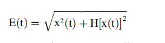

# 论文结构
第1节背景介绍。第2节介绍了预处理方法。第3节和第4节对特征和实验的细节进行了描述。讨论在第5节。第6节中给出了结论和未来的研究展望。

### 数据预处理

#### 心音数据的来源

   1. Physionet2016比赛数据集。心音数据集是Physionet2016比赛数据。
挑战训练集由五个数据库（A到E）组成，共有3126次心音记录，持续时间从5秒到120秒多一点。所有记录都被重新采样到2000赫兹，并以.wav格式提供。
   2. 数据集来源: 1000个正常或异常的心音文件，重采样为8000Hz 
   G.-Y. Yaseen, S. Kwon, Classification of Heart Sound Signal Using Multiple Features, Appl. Sci. 8 (12) (2018).
   3. iStethoscope Pro iPhone app
   4. 来自医院的数字听诊器
对数据集进行二分类，删除一部分不达标的数据，例如，数据长度不足的

#### 数据分割
根据心音特征和人体生理特征，以2s作为最小数据长度，丢弃小于2s的数据，确保切割结果包含足够的信息。每个文件只提取一个图像特征
#### 降噪
小波变换去噪：确定小波函数为Librosa库中的db8小波函数，分解层数为10，

#### 下采样 down-sample
对数据进行重新采样，采样频率为2Khz，使用python的Librosa语音处理库。因为心音的频率在20——600Hz，根据——奈奎斯特定理——在进行模拟/数字信号的转换过程中，
当采样频率fs.max大于信号中最高频率fmax的2倍时(fs.max>2fmax)， 采样之后的数字信号完整地保留了原始信号中的信息，一般实际应用中保证采样频率为信号最高频率的2.56～4倍
#### 特征提取
##### Log-Mel spectrogram
如果能在心音系统中模拟人类听觉感知处理的特征，就有可能提高心音分类的识别率。Log-Mel考虑了人类的听觉特征，这也符合医生使用听诊器进行听诊的事实。
它首先基于听觉感知将线性频谱映射到梅尔非线性频谱，然后将其转换为频谱。

快速傅里叶变换x[t]是采样的一维离散心音序列数据，N是帧长度，x[t]为N个点的复数序列。取其绝对值，得到心音信号的幅度频谱。
之后，需要将实际频率转换为梅尔频率标度。Mel频率和Hz频率之间的详细计算关系如下。

Mel录波器组，三角型滤波器
将计算出的输出乘以通过快速傅立叶变换计算出的能谱，即在将三角滤波器组的输出应用于能谱之后获得Mel谱。具体应用公式如下
然后对于一帧将获得M个输出。然后及时叠加多个输出，以获得梅尔级的声音频谱。然后可以通过将其转换为对数标度来获得logmel光谱。

##### 对数功率谱图——通过傅里叶变换的值东岱范围特别大，故选择对数功率谱
功率谱反映了不同时间频率下声音信号的功率强度，第二个特征是对数功率谱图。它是通过对功率谱进行对数变换获得的，功率谱反映了不同时间频率下声音信号的功率强度。选择此功能有两个原因。
一方面，正常人的心音信号在20-600hz范围内，并且随着时间的推移具有标准化分布。心音信号的对数功率谱可能具有检测异常频带的能力，因此在心音分类中具有很大的潜力。
另一方面，该特征本质上类似于Mel谱图，因为这两者都可以通过处理原始信号的快速傅立叶变换后获得的特征来获得。在某种程度上，它们本质上是时频域特征。

对于心音信号，执行快速傅立叶变换以获取幅度频谱。然后，通过对其进行绝对值和平方运算来获得功率谱。 最后，通过对功率谱进行对数运算来找到对数功率谱。

##### 波形图——时域信息
##### 心音信号的包络——希尔伯特包络
x(t)为实部，x(t)为特定信号作为实部，将对应的希尔伯特变换作为虚部其中E（t）是实信号x（t）的包络，公式为：

**心音信号可以近似为一维对称信号，因此上包络线和下包络线的形状几乎相同。因此，为了减少冗余计算消耗，本实验只提取了上包络。**

### 实验和结果
#### 迁移学习
本文使用的迁移学习方法是基于模型的，也称为基于参数的迁移学习。转移的知识在模型级别由源任务和目标任务共享，并被编码到模型参数、模型架构和其他模型级别
#### 分类算法详细信息

评估指标：  准确性、精密度、召回率。 训练批次和时间
#### 评估指标
准确度   真阳性（TP）、假阳性（FP）、真阴性（TN）和假阴性（FN）。当a=1 
F1结合了P和R的结果。当F1较高时，表明测试方法更有效。
#### 结果

对四种特征 使用相同的网络模型进行训练 包络信号和心音波形的准确率较低在90%以下。

### 结论

### 不同特征的讨论

